# 📡 Análisis Estratégico de Churn (abandono) y Fidelización de Clientes (SQL)


## 📊 Resumen (Overview)
En la industria de telecomunicaciones, la retención de clientes es un factor clave para la sostenibilidad y rentabilidad del negocio. Este proyecto simula el entorno de una empresa del sector que enfrenta altos niveles de **abandono (churn)**, impactando directamente en sus ingresos y participación de mercado.

El objetivo principal es analizar el comportamiento de los usuarios, identificar patrones de abandono y generar **insights es   tratégicos** para diseñar acciones de fidelización basadas en datos.

## 🎯 Objetivo General
Analizar los factores que influyen en el abandono de clientes (churn) en el sector de telecomunicaciones mediante consultas SQL y análisis exploratorio de datos, con el fin de proponer estrategias de fidelización y retención basadas en datos.

## ✅ Objetivos Específicos

- Diseñar un modelo relacional normalizado para el análisis del churn.
- Identificar patrones de abandono según variables demográficas y financieras.
- Detectar segmentos de clientes con mayor riesgo de cancelación.
- Cuantificar el impacto económico del churn.
- Proponer estrategias de retención orientadas a clientes de alto valor.

## 🏢 Problema de Negocio

Las empresas de telecomunicaciones enfrentan altos costos asociados a la pérdida de clientes. 
Captar nuevos usuarios suele ser más costoso que retener los existentes, por lo que identificar patrones de abandono se convierte en una necesidad estratégica.

El churn impacta directamente en:

- Ingresos recurrentes.
- Participación de mercado.
- Costos de adquisición.
- Reputación del servicio.

Este proyecto busca transformar datos operacionales en información útil para reducir el abandono y mejorar la fidelización.

## 📂 Estructura del Proyecto

- [🔍 Sobre los Datos](#-sobre-los-datos)
- [🏗️ Fase 1: Modelado de Datos (ETL)](#️-fase-1-modelado-de-datos-etl)
- [📊 Fase 2: Análisis Exploratorio y KPIs](#-fase-2-análisis-exploratorio-y-kpis-enfoque-narrativo)
- [🚀 Fase 3: Análisis Avanzado](#-fase-3-análisis-avanzado)
- [🏁 Conclusión General y Recomendaciones Estratégicas](#-conclusión-general-y-recomendaciones-estratégicas)
- [📈 Impacto Esperado](#-impacto-esperado)
- [🔚 Cierre del Proyecto](#cierre-del-proyecto)

---
## 🔍 Sobre los Datos

## 🔍 Sobre los Datos

El dataset utilizado en este proyecto fue obtenido desde Kaggle y puede encontrarse [🔗 aquí](https://www.kaggle.com/datasets/muhammadshahidazeem/customer-churn-dataset).

A partir del conjunto de datos original, se realizó un proceso de adaptación, enriquecimiento y normalización con el objetivo de simular un entorno real de producción dentro del sector de telecomunicaciones peruano.

El proyecto fue diseñado para representar escenarios empresariales relacionados con la retención de clientes, el análisis de comportamiento y la identificación de patrones de abandono (**Churn**) mediante el uso de SQL y análisis exploratorio de datos.

---

### 📡 Adaptación al Contexto Peruano

Con el fin de generar un análisis más realista y alineado al mercado nacional, se incorporaron variables estratégicas relacionadas con operadores y regiones del Perú.

#### 📶 Operadores de Telecomunicaciones

Se añadieron los principales operadores del mercado peruano:

- Claro
- Movistar
- Entel
- Bitel

Esto permite evaluar diferencias en:

- Participación de mercado
- Niveles de fidelización
- Calidad de retención
- Tasas de churn por operador

---

### 🌎 Regionalización del Dataset

También se incorporaron regiones representativas del país, entre ellas:

- Lima
- Piura
- Cusco
- Iquitos
- Trujillo
- Huancayo
- Arequipa
- Chiclayo
- Huancayo
- Iquitos

La regionalización permite identificar posibles problemas relacionados con:

- Cobertura de red
- Calidad del servicio
- Infraestructura técnica
- Diferencias de comportamiento entre regiones

---

### 🏗️ Procesamiento y Normalización

El dataset fue transformado y normalizado en un modelo relacional compuesto por tres tablas principales:

- `Clientes`
- `Servicios`
- `Facturacion`

La normalización permitió garantizar:

- ✅ Integridad de los datos
- ✅ Reducción de redundancia
- ✅ Mayor eficiencia en consultas SQL
- ✅ Mejor organización de la información
- ✅ Escalabilidad para futuros dashboards y modelos predictivos

---

### 📌 Características del Dataset

El conjunto de datos final cuenta con:

- 📊 **64,374 registros**
- 🗂️ **3 tablas relacionales**
- 👥 Información demográfica de clientes
- 🌎 Datos de múltiples regiones del Perú
- 📡 Información operativa de operadores telecom
- 💳 Variables financieras y de comportamiento
- 📈 Indicadores clave para análisis de retención y fidelización
- 🧠 Información útil para la construcción de estrategias de Customer Success

```sql
SELECT 
    C.*, 
    S.Subscription_Type, S.Contract_Length, S.Operador, S.Support_Calls,
    F.Total_Spend, F.Payment_Delay, F.Tenure, F.Churn
FROM Clientes C
JOIN Servicios S ON C.CustomerID = S.CustomerID
JOIN Facturacion F ON C.CustomerID = F.CustomerID;
```
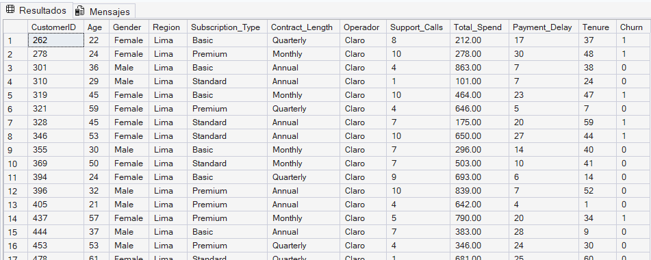

## 🏗️ Fase 1: Modelado de Datos (ETL)
El dataset original fue normalizado en un modelo relacional de 3 tablas para garantizar integridad y eficiencia.

### Beneficios del Modelo Relacional

- Mayor eficiencia en consultas SQL.
- Mejor organización de los datos.
- Eliminación de duplicidad.
- Escalabilidad para futuros dashboards y modelos predictivos.
- Base sólida para análisis estratégicos y toma de decisiones.


```sql
CREATE TABLE Clientes (
    CustomerID INT PRIMARY KEY,
    Age INT,
    Gender VARCHAR(20),
    Region VARCHAR(50)
);

CREATE TABLE Servicios (
    ID_Servicio INT IDENTITY(1,1) PRIMARY KEY,
    CustomerID INT,
    Subscription_Type VARCHAR(50),
    Contract_Length VARCHAR(50),
    Usage_Frequency INT,
    Support_Calls INT,
    Operador VARCHAR(50),

    FOREIGN KEY (CustomerID) REFERENCES Clientes(CustomerID)
);

CREATE TABLE Facturacion (
    ID_Facturacion INT IDENTITY(1,1) PRIMARY KEY,
    CustomerID INT,
    Total_Spend DECIMAL(10,2),
    Payment_Delay INT,
    Tenure INT,
    Last_Interaction INT,
    Churn INT,

    FOREIGN KEY (CustomerID) REFERENCES Clientes(CustomerID)
);              

INSERT INTO Clientes (CustomerID, Age, Gender, Region)
SELECT 
    CustomerID,
    Age,
    Gender,
    Region
FROM customer_churn_final;

SELECT COUNT(*) FROM Clientes;

INSERT INTO Servicios (
    CustomerID,
    Subscription_Type,
    Contract_Length,
    Usage_Frequency,
    Support_Calls,
    Operador
)
SELECT 
    CustomerID,
    Subscription_Type,
    Contract_Length,
    Usage_Frequency,
    Support_Calls,
    Operador
FROM customer_churn_final;

SELECT COUNT(*) FROM Servicios;

INSERT INTO Facturacion (
    CustomerID,
    Total_Spend,
    Payment_Delay,
    Tenure,
    Last_Interaction,
    Churn
)
SELECT 
    CustomerID,
    Total_Spend,
    Payment_Delay,
    Tenure,
    Last_Interaction,
    Churn
FROM customer_churn_final;

SELECT COUNT(*) FROM Facturacion; 
```

### 📋 Diccionario de Datos

Las variables del proyecto se organizan en tres grandes dominios de información:

---

### 👥 1. Datos Demográficos (Tabla: Clientes)

Contiene información básica y geográfica de cada cliente.

| Campo | Descripción |
|---|---|
| `CustomerID` | Identificador único del cliente |
| `Age` | Edad del usuario |
| `Gender` | Género del cliente |
| `Region` | Región geográfica del cliente |

#### 🎯 Objetivo del dominio
Permite segmentar clientes según características demográficas y analizar diferencias de churn entre regiones y grupos poblacionales.

---

### 📡 2. Datos Operativos y de Servicio (Tabla: Servicios)

Describe la relación comercial y operativa entre el cliente y la empresa.

| Campo | Descripción |
|---|---|
| `Subscription_Type` | Tipo de plan contratado |
| `Contract_Length` | Duración del contrato |
| `Usage_Frequency` | Frecuencia de uso del servicio |
| `Support_Calls` | Número de llamadas a soporte |
| `Operador` | Empresa proveedora del servicio |

#### 🎯 Objetivo del dominio
Permite identificar problemas operativos y evaluar factores relacionados con la satisfacción del cliente y la fidelización.

---

### 💳 3. Datos Financieros y de Estado (Tabla: Facturacion)

Contiene información económica y métricas asociadas al comportamiento financiero del cliente.

| Campo | Descripción |
|---|---|
| `Total_Spend` | Gasto total realizado por el cliente |
| `Payment_Delay` | Días de retraso en pagos |
| `Tenure` | Antigüedad del cliente |
| `Last_Interaction` | Días desde la última interacción |
| `Churn` | Indicador de abandono (1 = abandono, 0 = activo) |

#### 🎯 Objetivo del dominio
Permite medir el impacto económico del churn y detectar indicadores financieros asociados al riesgo de abandono.

---

### 🧠 Valor Estratégico de los Datos

La combinación de variables demográficas, operativas y financieras permite:

- Identificar clientes con alto riesgo de fuga.
- Detectar patrones de abandono.
- Analizar el impacto económico del churn.
- Construir estrategias de fidelización basadas en datos.
- Generar insights útiles para la toma de decisiones empresariales.

## 🔍 Fase 2: Análisis Exploratorio y KPIs (Enfoque Narrativo)

El análisis se desarrolla de forma progresiva, partiendo de una visión macro del problema hasta alcanzar **insights estratégicos** que impactan directamente en la toma de decisiones.

### 🟢 Nivel 1: Diagnóstico de Salud del Negocio (KPIs Descriptivos)

#### 1. Tasa General de Churn
**📌 Situación de negocio:** 
El primer paso consiste en dimensionar el problema: determinar qué proporción de clientes está abandonando el servicio.

*   **Valor:** Este indicador establece la línea base sobre la cual se construye todo el análisis.

```sql
SELECT 
    COUNT(*) AS Total_Clientes,
    SUM(CASE WHEN Churn = 1 THEN 1 ELSE 0 END) AS Clientes_Abandonaron,
    ROUND(SUM(CASE WHEN Churn = 1 THEN 1 ELSE 0 END) * 100.0 / COUNT(*), 2) AS Tasa_Churn
FROM Facturacion;
```
**🧠 Insight:**
La tasa general de churn muestra qué tan grande es el problema de pérdida de clientes en la empresa. Un churn alto indica baja fidelización y posibles problemas en el servicio, afectando directamente los ingresos y la estabilidad del negocio.

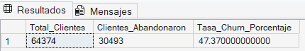

1. **Tasa General de Churn (47.37%)**: Una pérdida de casi la mitad de la cartera indica una crisis de retención. El costo de adquisición (CAC) debe ser altísimo para mantener operativa la empresa. Es urgente identificar si es un problema de producto o de mercado. 

    **Acción:** Implementar un "War Room" de Retención. Con una pérdida de casi la mitad de los clientes, se debe auditar el proceso de onboarding para asegurar que el cliente perciba valor en los primeros 30 días.


#### 2. Distribución de clientes por operador
**📌 Situación de negocio:** 
Antes de analizar el abandono, es necesario entender cómo se distribuye la cartera entre los distintos operadores.

*   **Valor:** Permite contextualizar el churn en función del tamaño de cada operador.

```sql
SELECT 
    Operador,
    COUNT(*) AS Total_Clientes
FROM Servicios
GROUP BY Operador
ORDER BY Total_Clientes DESC;
```
**🧠 Insight:**  Identifica qué operador tiene mayor participación de mercado, lo cual es clave para interpretar correctamente los niveles de abandono.

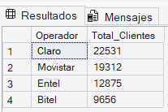

2.  y 3. **El Colapso de los "Challengers" (Bitel/Entel)**: Mientras Claro y Movistar mantienen tasas de churn saludables (~25%), Bitel (100%) y Entel (78%) están desapareciendo del dataset. El mercado peruano se está consolidando hacia los operadores con mejor infraestructura. 

    **Acción:** Benchmarking Competitivo. Dado que los clientes huyen de Bitel y Entel, se deben analizar las ofertas de Claro y Movistar para igualar beneficios o lanzar campañas de "Retorno" dirigidas a ex-clientes.

#### 3. Operador con mayor tasa de churn
**📌 Situación de negocio:** 
Conociendo la distribución, se evalúa qué operador pierde más clientes proporcionalmente.
*   **Valor:** Permite detectar debilidades en retención por operador.

```sql
SELECT 
    S.Operador,
    COUNT(*) AS Total_Clientes,
    SUM(CASE WHEN F.Churn = 1 THEN 1 ELSE 0 END) AS Abandonos,
    ROUND(SUM(CASE WHEN F.Churn = 1 THEN 1 ELSE 0 END) * 100.0 / COUNT(*), 2) AS Tasa_Churn
FROM Servicios S
JOIN Facturacion F ON S.CustomerID = F.CustomerID
GROUP BY S.Operador
ORDER BY Tasa_Churn DESC;
```
**🧠 Insight:**  Identifica qué operador tiene mayor participación de mercado, lo cual es clave para interpretar correctamente los niveles de abandono.

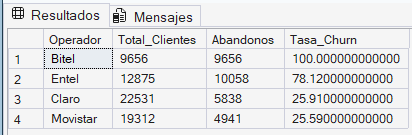

2. y 3. **El Colapso de los "Challengers" (Bitel/Entel)**: Mientras Claro y Movistar mantienen tasas de churn saludables (~25%), Bitel (100%) y Entel (78%) están desapareciendo del dataset. El mercado peruano se está consolidando hacia los operadores con mejor infraestructura.

#### 4. Regiones con mayor churn
**📌 Situación de negocio:** 
Se analiza si el abandono varía según la ubicación geográfica
*   **Valor:** Introduce el factor territorial en la toma de decisiones.

```sql
SELECT 
    C.Region,
    COUNT(*) AS Total_Clientes,
    SUM(CASE WHEN F.Churn = 1 THEN 1 ELSE 0 END) AS Abandonos,
    ROUND(SUM(CASE WHEN F.Churn = 1 THEN 1 ELSE 0 END) * 100.0 / COUNT(*), 2) AS Tasa_Churn
FROM Clientes C
JOIN Facturacion F ON C.CustomerID = F.CustomerID
GROUP BY C.Region
ORDER BY Tasa_Churn DESC;
```
**🧠 Insight:**  Identifica qué operador tiene mayor participación de mercado, lo cual es clave para interpretar correctamente los niveles de abandono.

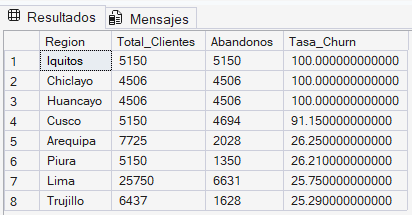

4. **Geografía del Abandono**: El abandono total (100%) en Iquitos, Chiclayo y Huancayo sugiere una brecha de conectividad. No es un problema de marketing; es un problema de ingeniería de red en provincias.

     **Acción:** Auditoría Técnica de Infraestructura. Suspender temporalmente campañas de captación en Iquitos, Chiclayo y Huancayo hasta que el área técnica garantice estabilidad de red. Es mejor no captar que captar para perder.

#### 5. Tipo de suscripción con mayor churn
**📌 Situación de negocio:** 
Se evalúa qué tipo de plan presenta mayor tasa de cancelación.
*   **Valor:** Permite identificar productos problemáticos.

```sql
SELECT 
    S.Subscription_Type,
    COUNT(*) AS Total,
    SUM(CASE WHEN F.Churn = 1 THEN 1 ELSE 0 END) AS Cancelaciones,
    ROUND(SUM(CASE WHEN F.Churn = 1 THEN 1 ELSE 0 END) * 100.0 / COUNT(*), 2) AS Tasa_Churn
FROM Servicios S
JOIN Facturacion F ON S.CustomerID = F.CustomerID
GROUP BY S.Subscription_Type
ORDER BY Tasa_Churn DESC;
```
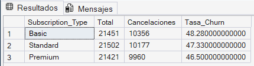

5. **Suscripciones (Riesgo Homogéneo):** El churn no discrimina por nivel de pago (Basic vs Premium). Esto significa que pagar más no garantiza una mejor experiencia o fidelidad, lo cual es peligroso para el ARPU (Ingreso promedio por usuario).

    **Acción:** Diferenciación de Propuesta de Valor. Rediseñar el plan "Premium". Si el churn es igual al del plan básico, el cliente Premium no siente exclusividad. Añadir beneficios como soporte técnico prioritario o bonos de datos sin costo.

**🧠 Insight:**  Identifica qué operador tiene mayor participación de mercado, lo cual es clave para interpretar correctamente los niveles de abandono.

### 🟡 Nivel 2: Identificación de causas

#### 6. Relación entre soporte y churn
**📌 Situación de negocio:** 
Se analiza si el número de reclamos influye en la decisión de abandonar.
*   **Valor:** Mide el impacto de la experiencia del cliente.

```sql
SELECT 
    S.Support_Calls,
    COUNT(*) AS Total,
    SUM(CASE WHEN F.Churn = 1 THEN 1 ELSE 0 END) AS Abandonos,
    ROUND(SUM(CASE WHEN F.Churn = 1 THEN 1 ELSE 0 END) * 100.0 / COUNT(*), 2) AS Tasa_Churn
FROM Servicios S
JOIN Facturacion F ON S.CustomerID = F.CustomerID
GROUP BY S.Support_Calls
ORDER BY S.Support_Calls;
```

**🧠 Insight:**  Un mayor número de llamadas a soporte suele estar asociado a una mayor probabilidad de abandono.

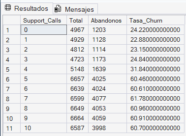

6. **El Umbral de la Paciencia (Soporte)**: El "punto de no retorno" es la 5ta llamada. Un cliente que llama 4 veces tiene 24% de riesgo, pero a la 5ta llamada el riesgo salta al 60%. 

    **Acción:** Protocolo de Escalamiento Proactivo. Crear una alerta automática en el CRM. Al llegar a la 3ra llamada por el mismo incidente, el caso debe pasar a un supervisor senior para cierre definitivo antes de que el cliente llegue a la 5ta llamada (punto de no retorno).


#### 7. Impacto del retraso en pagos
**📌 Situación de negocio:** 
Se evalúa si la morosidad influye en el churn.
*   **Valor:** Introduce una dimensión financiera

```sql
SELECT 
    Payment_Delay,
    COUNT(*) AS Total,
    SUM(CASE WHEN Churn = 1 THEN 1 ELSE 0 END) AS Abandonos,
    ROUND(SUM(CASE WHEN Churn = 1 THEN 1 ELSE 0 END) * 100.0 / COUNT(*), 2) AS Tasa_Churn
FROM Facturacion
GROUP BY Payment_Delay
ORDER BY Payment_Delay;
```
**🧠 Insight:**  Clientes con retrasos frecuentes tienen mayor tendencia a abandonar el servicio.

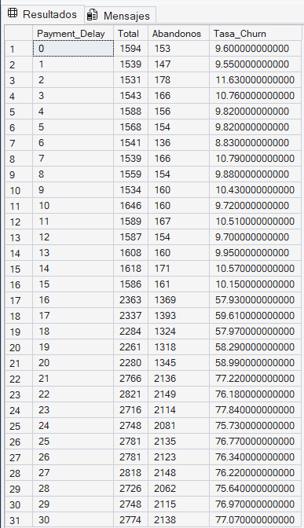

7. **Morosidad como Predictor (16 días)**: Los primeros 15 días de retraso son incidentales (churn <11%). Sin embargo, al día 16 el cliente "se desconecta" emocionalmente del servicio (churn >57%). La cobranza debe ser preventiva, no reactiva.

    **Acción:** Cobranza Preventiva y Empática. Iniciar recordatorios de pago automáticos el día 10. Si llega al día 15 sin pago, ofrecer una "Promesa de Pago" o fraccionamiento inmediato antes de que el cliente decida abandonar el servicio el día 16.

#### 8. Clientes de alto valor en riesgo
**📌 Situación de negocio:** 
Identificar clientes con alto gasto que están abandonando.
*   **Valor:** Detecta pérdidas económicas importantes.
```sql
SELECT 
    CustomerID,
    Total_Spend
FROM Facturacion
WHERE Total_Spend > (SELECT AVG(Total_Spend) FROM Facturacion)
AND Churn = 1;
```
**🧠 Insight:**  La pérdida de clientes de alto valor impacta directamente en los ingresos.

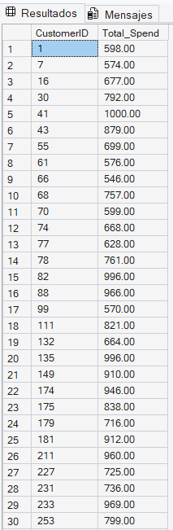

**SE MUESTRA SOLO UNA PARTE DE CLIENTES DEL TOTAL (64374)** 

8. **Desangre de Capital (High Value)**: La pérdida de clientes con gastos cercanos a S/ 1,000 representa la mayor amenaza para el flujo de caja. Perder un cliente de alto valor equivale a perder cinco clientes básicos.

    **Acción:** Programa de "White Glove" (Guante Blanco). Asignar un ejecutivo de cuenta dedicado a los clientes con gasto > S/ 800. Un contacto humano personalizado puede salvar cuentas que representan ingresos masivos.

#### 9. Región + operador con mayor churn
**📌 Situación de negocio:** 
Se cruzan variables para detectar focos críticos.
*   **Valor:** Permite segmentación avanzada.

```sql
SELECT 
    C.Region,
    S.Operador,
    COUNT(*) AS Total,
    SUM(CASE WHEN F.Churn = 1 THEN 1 ELSE 0 END) AS Abandonos
FROM Clientes C
JOIN Servicios S ON C.CustomerID = S.CustomerID
JOIN Facturacion F ON C.CustomerID = F.CustomerID
GROUP BY C.Region, S.Operador
ORDER BY Abandonos DESC;
```

**🧠 Insight:**  Permite ubicar exactamente dónde ocurre la mayor pérdida de clientes.


9. **Focos de Conflicto (Región + Operador)**: Confirmamos que el problema de Bitel y Entel es geográfico. Su incapacidad de retener en provincias como Cusco o Iquitos es el principal motor del churn global del proyecto.

    **Acción:** Plan de Rescate Regional. Ejecutar un plan piloto en Cusco y Chiclayo (Entel) ofreciendo descuentos del 50% por 3 meses a cambio de permanencia, mientras se estabiliza el servicio técnico local.

## 🚀 Fase 3: Análisis Avanzado

### 🔴 Nivel Avanzado — Estrategia y toma de decisiones

#### 10. Churn por grupo de edad
**📌 Situación de negocio:** 
Se analiza si el abandono varía según características demográficas.
*   **Valor:** Segmentación de clientes.

```sql
SELECT 
    CASE 
        WHEN Age < 25 THEN 'Jovenes'
        WHEN Age BETWEEN 25 AND 40 THEN 'Adultos'
        ELSE 'Mayores'
    END AS Grupo_Edad,
    COUNT(*) AS Total,
    SUM(CASE WHEN F.Churn = 1 THEN 1 ELSE 0 END) AS Abandonos
FROM Clientes C
JOIN Facturacion F ON C.CustomerID = F.CustomerID
GROUP BY 
    CASE 
        WHEN Age < 25 THEN 'Jovenes'
        WHEN Age BETWEEN 25 AND 40 THEN 'Adultos'
        ELSE 'Mayores'
    END;
```
**🧠 Insight:**  Permite identificar segmentos demográficos más propensos al abandono.

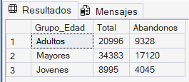

10. **Volumen Demográfico (Mayores):** Aunque todos los grupos tienen tasas similares, el segmento de "Mayores" es el que más clientes aporta al churn (17,120). Es el segmento con mayor potencial de recuperación mediante atención personalizada.

    **Acción:** Simplificación de Canales. El volumen de pérdida en este grupo sugiere que podrían tener dificultades con canales digitales. Habilitar una línea telefónica de atención simplificada o asistencia técnica presencial bonificada.

#### 11. Contratos vs churn
**📌 Situación de negocio:** 
Se evalúa si la duración del contrato influye en la retención.
*   **Valor:** Mide estabilidad del cliente.

```sql
SELECT 
    S.Contract_Length,
    COUNT(*) AS Total,
    SUM(CASE WHEN F.Churn = 1 THEN 1 ELSE 0 END) AS Abandonos
FROM Servicios S
JOIN Facturacion F ON S.CustomerID = F.CustomerID
GROUP BY S.Contract_Length;
```
**🧠 Insight:**  Contratos más cortos suelen presentar mayor churn.

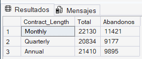

11. **La Puerta Giratoria (Contratos Mensuales)**: Los contratos "Monthly" son los más volátiles. El README debe destacar la necesidad de estrategias de "Lock-in" (migración a planes anuales) para estabilizar la cartera.

    **Acción:** Estrategia de Fidelización Contractual. Ofrecer un "Mes Gratis" o un dispositivo nuevo a los clientes "Monthly" que acepten migrar a un contrato anual. Esto estabiliza el flujo de caja a largo plazo.


#### 12. Retención por antigüedad
**📌 Situación de negocio:** 
Se analiza qué operador retiene mejor a clientes con mayor antigüedad.
*   **Valor:** Evalúa fidelización real.
```sql
SELECT 
    S.Operador,
    AVG(F.Tenure) AS Promedio_Antiguedad
FROM Servicios S
JOIN Facturacion F ON S.CustomerID = F.CustomerID
GROUP BY S.Operador;
```
**🧠 Insight:**  Operadores con mayor antigüedad promedio muestran mejor retención.

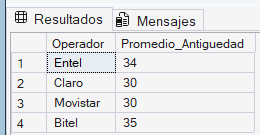

12. **El Espejismo de la Antigüedad**: Tener clientes antiguos (promedio 35 meses) no garantiza lealtad si el servicio actual falla. Bitel pierde clientes de larga data, lo que indica que la competencia está ofreciendo mejores incentivos de migración.

    **Acción**: Plan de Reconocimiento a la Lealtad. No dar por sentado al cliente antiguo. Implementar bonos por cada año de permanencia para evitar que operadores rivales los seduzcan con ofertas de portabilidad.


#### 13. Perfil de cliente de alto riesgo
**📌 Situación de negocio:** 
Se identifican patrones de clientes con alta probabilidad de churn.
*   **Valor:** Acercamiento a análisis predictivo.
```sql
SELECT 
    CustomerID,
    Support_Calls,
    Payment_Delay
FROM Servicios S
JOIN Facturacion F ON S.CustomerID = F.CustomerID
WHERE Support_Calls > 5 AND Payment_Delay > 5;
```

**🧠 Insight:**  Clientes con alto nivel de reclamos y retrasos presentan mayor riesgo.

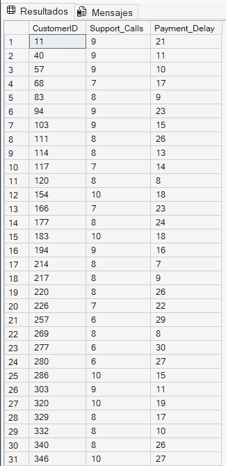

**SE MUESTRA SOLO UNA PARTE DE CLIENTES DEL TOTAL (30781)** 

13. **El Perfil del "Cadáver Digital"**: Identificamos al cliente de máximo riesgo: >5 llamadas + >20 días de retraso. Este perfil permite al negocio dejar de gastar en marketing inútil y enfocarse en salvar lo salvable.

    **Acción:** Stop-Loss de Marketing. Dejar de invertir presupuesto de marketing en clientes que ya tienen >8 llamadas y >20 días de retraso (ya están perdidos). Redirigir ese presupuesto a fidelizar al segmento de "Media Prioridad".

#### 14. Pérdida económica por churn
**📌 Situación de negocio:** 
Se cuantifica el impacto financiero del abandono.
*   **Valor:** Mide pérdidas reales.
```sql
SELECT 
    SUM(Total_Spend) AS Perdida_Total
FROM Facturacion
WHERE Churn = 1;
```

**🧠 Insight:**  Permite entender cuánto dinero se pierde por falta de retención.

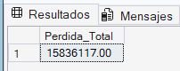

14. **El Costo del Silencio (S/ 1.5M)**: Esta cifra es el "titular" de tu proyecto. El churn no es solo una métrica, es una pérdida millonaria directa que impacta la valoración de la empresa.

    **Acción:** Inversión en Customer Success. Utilizar este monto como justificación presupuestaria ante la gerencia para contratar herramientas de análisis predictivo que permitan anticiparse al churn antes de que la pérdida ocurra.


#### 15. Priorización de clientes para retención
**📌 Situación de negocio:** 
Se segmentan clientes según valor y riesgo.
*   **Valor:** Permite tomar decisiones estratégicas.
```sql
SELECT 
    CustomerID,
    Total_Spend,
    CASE 
        WHEN Total_Spend > 1000 AND Churn = 1 THEN 'ALTA PRIORIDAD'
        WHEN Total_Spend <= 1000 AND Churn = 1 THEN 'MEDIA PRIORIDAD'
        ELSE 'BAJA PRIORIDAD'
    END AS Segmento
FROM Facturacion;
```
**🧠 Insight:**  Permite enfocar estrategias en clientes de mayor impacto económico.

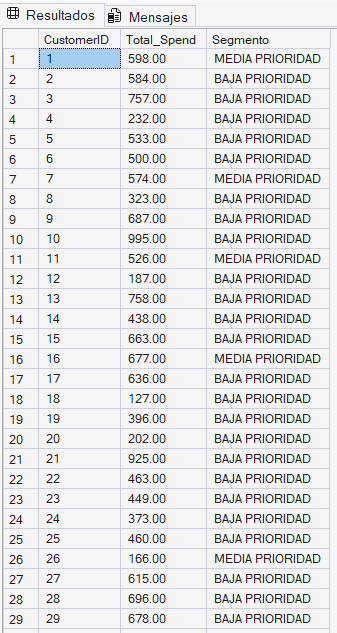

**SE MUESTRA SOLO UNA PARTE DE CLIENTES DEL TOTAL (64374)** 

15. **Priorización Estratégica**: No todos los clientes valen el mismo esfuerzo de retención. La segmentación permite optimizar el presupuesto del departamento de Customer Success hacia los clientes de "Alta Prioridad".

    **Acción:** Matriz de Esfuerzo vs. Impacto. Concentrar al equipo de ventas de retención exclusivamente en el segmento de "Alta Prioridad" (Alto gasto / Riesgo inminente) para maximizar el ROI de cada llamada de rescate.

## 🏁 Conclusión General y Recomendaciones Estratégicas

Tras el análisis exhaustivo de los **64,374 registros**, se concluye que la empresa enfrenta una importante crisis de retención, con una pérdida económica proyectada de:

## 💸 S/ 1,583,617.00

El abandono de clientes no ocurre de forma aleatoria, sino que está relacionado con problemas específicos en la experiencia del cliente, la infraestructura regional y la gestión operativa del servicio.

---

## 📌 Conclusiones Clave (Insights)

## 🌎 Fallo Sistémico en Provincias
Las regiones de **Iquitos, Chiclayo y Huancayo** presentan niveles extremos de churn, asociados principalmente al bajo rendimiento de los operadores **Bitel** y **Entel** en dichas zonas.

> 🔎 Insight: La calidad del servicio regional impacta directamente en la permanencia de los clientes.

---

## 📞 Umbral Crítico de Soporte Técnico
Se identificó una relación directa entre el número de llamadas a soporte y el abandono.

- A partir de la **quinta llamada**, la probabilidad de churn supera el **60%**.

> 🔎 Insight: La mala experiencia en soporte técnico acelera significativamente la pérdida de clientes.

---

### 💳 Predictor Financiero de Abandono
Los clientes con retrasos de pago superiores a **16 días** presentan un riesgo de fuga mayor al **57%**.

> 🔎 Insight: La morosidad funciona como un indicador temprano de desconexión y abandono.

---

### 📄 Inestabilidad Contractual
Los contratos de tipo **Monthly** concentran la mayor cantidad de cancelaciones.

> 🔎 Insight: Los planes de corta duración generan menor fidelización y mayor volatilidad.

---

## 🚀 Recomendaciones Estratégicas

### ✅ Gestión Proactiva de la Experiencia del Cliente

- Implementar un sistema de alerta temprana para clientes con múltiples reclamos.
- Escalar automáticamente a soporte senior los casos con más de 3 incidencias.
- Reducir tiempos de respuesta y mejorar la resolución de problemas.

---

### ✅ Reestructuración de la Estrategia Regional

- Realizar auditorías técnicas en regiones con alto churn.
- Priorizar mejoras de infraestructura en Iquitos, Chiclayo y Huancayo.
- Redirigir inversiones de marketing hacia optimización de red y cobertura.

---

### ✅ Optimización del Ciclo de Cobranza

- Enviar recordatorios automáticos desde el día 10 de retraso.
- Ofrecer refinanciamiento antes del día 16.
- Implementar estrategias de cobranza preventiva y no invasiva.

---

### ✅ Protección de Clientes de Alto Valor

- Crear programas VIP para clientes con mayor gasto.
- Implementar atención preferencial y beneficios exclusivos.
- Priorizar la retención de clientes con alto impacto económico.

---

### ✅ Incentivos de Permanencia

- Promover la migración de contratos mensuales hacia planes anuales.
- Ofrecer bonos, descuentos y beneficios por permanencia.
- Incrementar la estabilidad y fidelización de la cartera de clientes.

---

## 📈 Impacto Esperado

La implementación de estas estrategias permitirá:

- Reducir la tasa de churn.
- Mejorar la experiencia del cliente.
- Incrementar la fidelización.
- Disminuir pérdidas económicas.
- Optimizar la toma de decisiones basada en datos.

## Cierre del Proyecto

El presente proyecto permitió analizar de manera estratégica el problema de churn en el sector de telecomunicaciones mediante el uso de SQL y técnicas de análisis de datos.  

A través del modelado relacional, la construcción de KPIs y el análisis exploratorio, fue posible identificar patrones críticos de abandono relacionados con factores como soporte técnico, retrasos en pagos, tipo de contrato y ubicación geográfica.

Los resultados obtenidos demuestran cómo el análisis de datos puede convertirse en una herramienta clave para la toma de decisiones empresariales, permitiendo reducir pérdidas económicas, mejorar la experiencia del cliente y fortalecer las estrategias de fidelización.

Finalmente, este trabajo evidencia la importancia de transformar los datos en información estratégica que genere valor real para el negocio y contribuya a construir organizaciones más eficientes, competitivas y orientadas al cliente.

